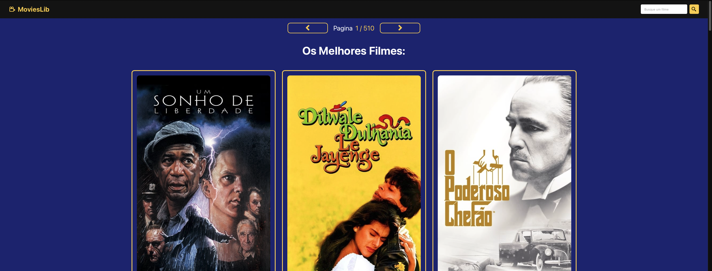
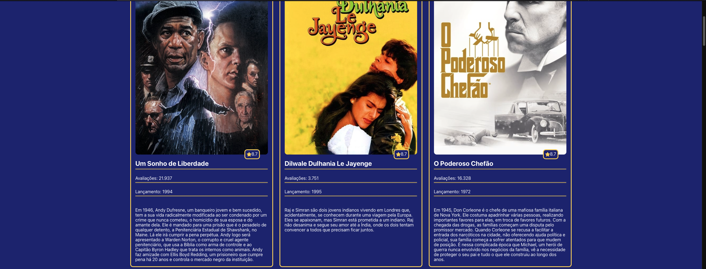
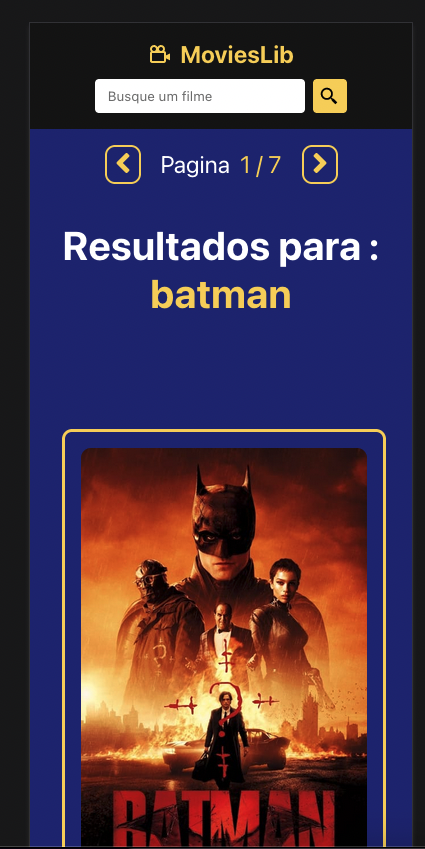
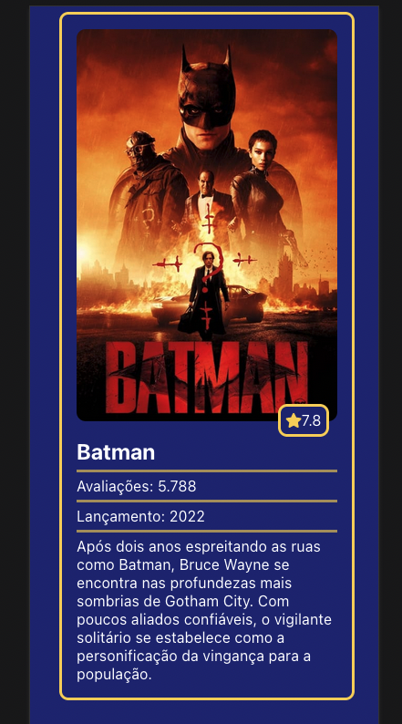

# filmes-tmdb
:bulb: Portfolio React JS Filmes Tmbd

# Objetivo

Aplicação que mostra, capa do filmes, avaliação, nome do filme, quantas avaliação foram feitas, ano de lançamento filme e a descrição do filme.

# Bibliotecas e tecnologias utilizados:

instalação: npm e yarn

React Js

Api:https://developers.themoviedb.org/3/getting-started/introduction

react-router-dom : Navegação para React JS.

react-icons: Icones vetorial para React JS.

axios: Consumo de api.

moment.js: Manipulação data e hora.

# React JS:

Imagens do aplicativo web: 
Clique na imagem para ampliar.

  
  

  Web responsivo:

  
  

Clique no video abaixo para demonstração da aplicação web com React JS:

  

<!--  -->
